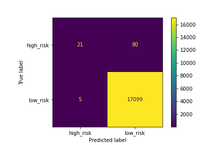
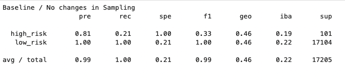
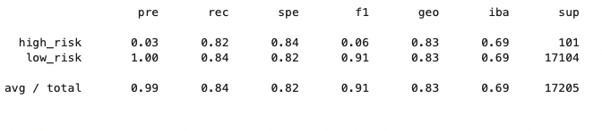
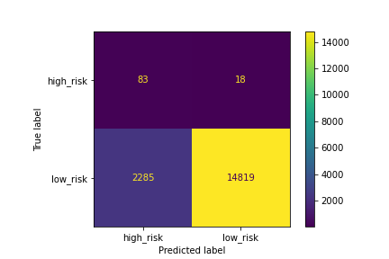
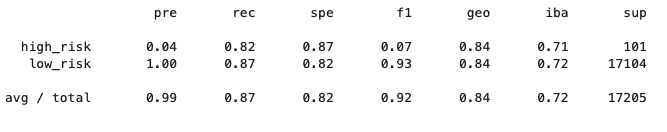
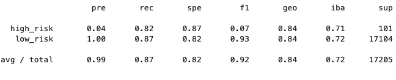
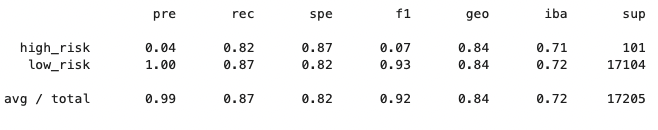
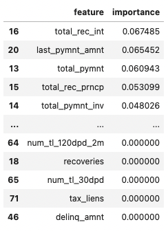
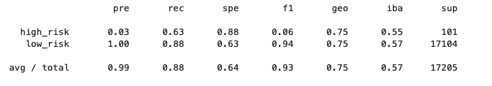
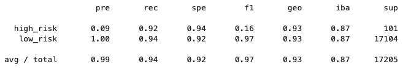

# Credit_Risk_Analysis

# Background / Overview

Jill commends you for all your hard work. Piece by piece, you’ve been building up your skills in data preparation, statistical reasoning, and machine learning. You are now ready to apply machine learning to solve a real-world challenge: credit card risk.

Credit risk is an inherently unbalanced classification problem, as good loans easily outnumber risky loans. Therefore, you’ll need to employ different techniques to train and evaluate models with unbalanced classes. Jill asks you to use imbalanced-learn and scikit-learn libraries to build and evaluate models using resampling.

Using the credit card credit dataset from LendingClub, a peer-to-peer lending services company, you’ll oversample the data using the RandomOverSampler and SMOTE algorithms, and undersample the data using the ClusterCentroids algorithm. Then, you’ll use a combinatorial approach of over- and undersampling using the SMOTEENN algorithm. Next, you’ll compare two new machine learning models that reduce bias, BalancedRandomForestClassifier and EasyEnsembleClassifier, to predict credit risk. Once you’re done, you’ll evaluate the performance of these models and make a written recommendation on whether they should be used to predict credit risk.

# Deliverables

**Deliverable 1: Use Resampling Models to Predict Credit Risk**

**Deliverable 2: Use the SMOTEENN Algorithm to Predict Credit Risk**

**Deliverable 3: Use Ensemble Classifiers to Predict Credit Risk**

**Deliverable 4: A Written Report on the Credit Risk Analysis (README.md)**

# RESULTS 
# Deliverable 1

**No Over/Under Sampling**

- An accuracy score for the model was calculated as 0.9951

**RandomOverSampler**

- Accuracy is 0.8325

**SMOTE**

- Accuracy is 0.8325

**ClusterCentroids**

- Accuracy score is 0.8325

# Deliverable 2

**SMOTEENN**

- Accuracy score is 0.8389

# Deliverable 3: Use Ensemble Classifiers to Predict Credit Risk

- Accuracy Score is 0.759

# Easy Ensemble Classifier

- Accuracy Score is 0.9319

# Analysis 

Summary:

After performing all of the models, I would recommend to use the EasyEnsembleClassifier as it did the best overall. Specifically witht he f1 rating score, 0.16. Compared to the rest it is the clear choice. Please see the data above to compare.